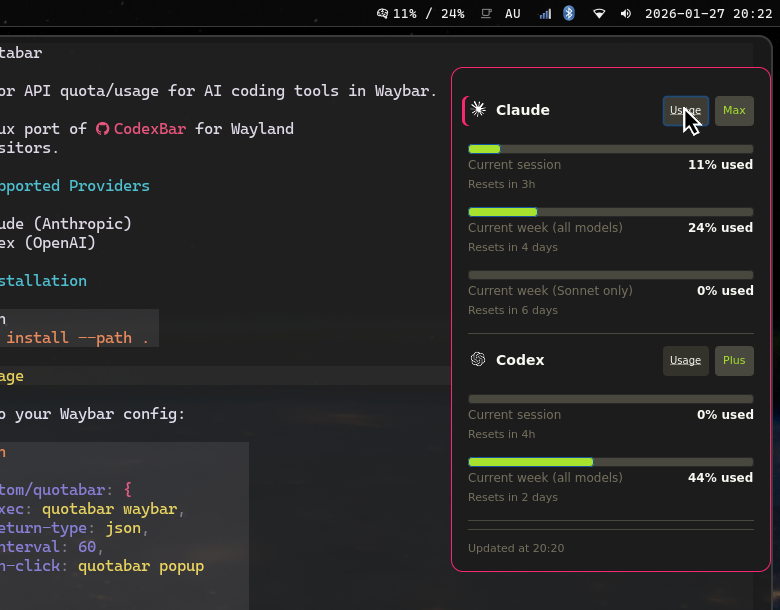

# quotabar

Monitor API quota/usage for AI coding tools in Waybar.

A Linux port of [CodexBar](https://github.com/steipete/CodexBar) for Wayland compositors.



## Supported Providers

- Claude (Anthropic)
- Codex (OpenAI)

## Installation

```bash
cargo install --path .
```

## Usage

Add to your Waybar config:

```json
{
  "custom/quotabar": {
    "exec": "quotabar waybar",
    "return-type": "json",
    "interval": 60,
    "on-click": "quotabar popup"
  }
}
```

## License

MIT - see [LICENSE](LICENSE) for details.

Inspired by [CodexBar](https://github.com/steipete/CodexBar) by Peter Steinberger.

Provider icons from [LobeHub Icons](https://github.com/lobehub/lobe-icons) (MIT License).
