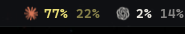
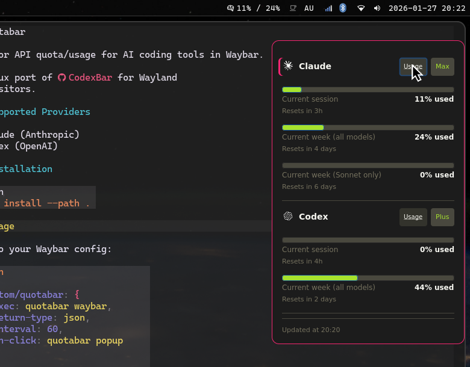

# quotabar

Monitor API quota/usage for AI coding tools in Waybar.

A Linux port of [CodexBar](https://github.com/steipete/CodexBar) for Wayland compositors.





## Supported Providers

- Claude (Anthropic)
- Codex (OpenAI)

## Installation

```bash
cargo install --path .
```

## Usage

Add one module per provider to your Waybar config. The text shows the
session percentage with the weekly percentage dimmed next to it; the
`warning` (≥75%) and `critical` (≥90%) classes apply per provider.

```json
{
  "custom/quotabar-claude": {
    "exec": "quotabar waybar --provider claude",
    "return-type": "json",
    "interval": 60,
    "on-click": "quotabar popup"
  },
  "custom/quotabar-codex": {
    "exec": "quotabar waybar --provider codex",
    "return-type": "json",
    "interval": 60,
    "on-click": "quotabar popup"
  }
}
```

Provider logos are embedded in the binary and written to
`~/.local/share/quotabar/` on each run, so Waybar CSS can use them as
background images:

```css
#custom-quotabar-claude,
#custom-quotabar-codex {
  background-repeat: no-repeat;
  background-position: 8px center;
  background-size: 14px 14px;
  padding: 0 8px 0 28px;
}

#custom-quotabar-claude {
  background-image: url("/home/USER/.local/share/quotabar/claude.svg");
}

#custom-quotabar-codex {
  background-image: url("/home/USER/.local/share/quotabar/openai.svg");
}
```

Running `quotabar waybar` without `--provider` outputs a single combined
module with a generic icon, falling back across providers.

## License

MIT - see [LICENSE](LICENSE) for details.

Inspired by [CodexBar](https://github.com/steipete/CodexBar) by Peter Steinberger.

Provider icons from [LobeHub Icons](https://github.com/lobehub/lobe-icons) (MIT License).
